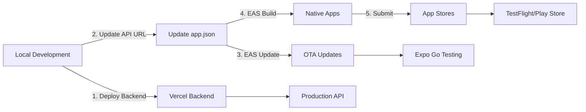

# 🚀 Fare Complete Deployment Guide

## Architecture Overview

Your Fare app consists of:
1. **Mobile App** (React Native) - Deployed via EAS Update/TestFlight/Play Store
2. **Backend API** (Node.js/Express) - Deployed to Vercel
3. **Database** (Supabase) - Already hosted

## 🎯 Current Status

✅ **Completed:**
- Mobile app deployed to EAS Update (Android & iOS bundles ready)
- Backend renamed to fare-api
- New EAS project created with "fare" slug
- Backend Vercel configuration created

⏳ **Pending:**
- Deploy backend to Vercel
- Build native apps for TestFlight/Play Store
- Update mobile app API URLs to production

## 📱 Part 1: Backend Deployment (Vercel)

### Step 1: Install Vercel CLI
```bash
npm install -g vercel
```

### Step 2: Deploy Backend
```bash
cd backend
vercel

# Follow prompts:
# - Set up and deploy: Yes
# - Which scope? (Choose your account)
# - Link to existing project? No
# - Project name: fare-api
# - Directory: ./
# - Override settings? No
```

### Step 3: Set Environment Variables
```bash
# Set all environment variables in Vercel dashboard or CLI
vercel env add SUPABASE_URL production
vercel env add SUPABASE_ANON_KEY production
vercel env add SUPABASE_SERVICE_KEY production
vercel env add PRIVY_APP_ID production
vercel env add PRIVY_APP_SECRET production
vercel env add STREAM_API_KEY production
vercel env add STREAM_API_SECRET production
vercel env add API_SECRET_KEY production
```

### Step 4: Get Your Production URL
After deployment, you'll get a URL like:
- `https://fare-api.vercel.app`

## 📲 Part 2: Update Mobile App Configuration

### Step 1: Update API URL
Edit `app.json`:
```json
{
  "expo": {
    "extra": {
      "apiUrl": "https://fare-api.vercel.app/api"
    }
  }
}
```

### Step 2: Create New EAS Update
```bash
npx eas update --branch production --message "Production release with Vercel backend"
```

## 🏗️ Part 3: Build Native Apps

### For iOS (TestFlight)
```bash
# Build for production
eas build --platform ios --profile production

# Wait for build to complete (~20-30 minutes)
# Then submit to App Store Connect
eas submit --platform ios --latest
```

### For Android (Play Store or APK)
```bash
# Build APK for direct distribution
eas build --platform android --profile preview

# OR build for Play Store
eas build --platform android --profile production
eas submit --platform android --latest
```

## 🔄 Complete Deployment Flow



## 📋 Deployment Checklist

### Backend (Vercel):
- [ ] Deploy backend to Vercel
- [ ] Set all environment variables
- [ ] Test API endpoints
- [ ] Verify database connection

### Mobile App:
- [ ] Update API URL to production
- [ ] Create production EAS update
- [ ] Build iOS app for TestFlight
- [ ] Build Android APK or AAB
- [ ] Submit to app stores

## 🌐 Environment URLs

### Development:
- Backend: `http://localhost:3000`
- Mobile: `npx expo start`

### Staging/Preview:
- Backend: `https://fare-api-preview.vercel.app`
- Mobile: EAS Update preview branch

### Production:
- Backend: `https://fare-api.vercel.app`
- Mobile: App Store / Play Store

## 🔑 Environment Variables Reference

### Backend (Vercel Dashboard):
```env
SUPABASE_URL=https://sxrvesdqhcovajaqnqcw.supabase.co
SUPABASE_ANON_KEY=<from-supabase-dashboard>
SUPABASE_SERVICE_KEY=<from-supabase-dashboard>
PRIVY_APP_ID=cmej9f9cp00xbl10b8zwjifec
PRIVY_APP_SECRET=<from-privy-dashboard>
STREAM_API_KEY=<from-stream-dashboard>
STREAM_API_SECRET=<from-stream-dashboard>
API_SECRET_KEY=<generate-secure-key>
```

### Mobile App (app.json):
```json
{
  "expo": {
    "extra": {
      "apiUrl": "https://fare-api.vercel.app/api",
      "supabaseUrl": "https://sxrvesdqhcovajaqnqcw.supabase.co",
      "supabaseAnonKey": "<same-as-backend>"
    }
  }
}
```

## 🚨 Important Notes

1. **API URL**: After deploying backend to Vercel, update the mobile app's API URL
2. **Environment Variables**: Never commit sensitive keys to git
3. **CORS**: Backend is configured to accept requests from mobile apps
4. **Testing**: Always test in Expo Go before building native apps
5. **Updates**: Use EAS Update for JavaScript changes, rebuild for native changes

## 📊 Monitoring

### Backend (Vercel):
- View logs: `vercel logs fare-api`
- View functions: Vercel Dashboard → Functions tab
- Monitor errors: Vercel Dashboard → Analytics

### Mobile (EAS):
- View updates: https://expo.dev/accounts/0xbigotry/projects/fare
- Monitor crashes: EAS Dashboard → Diagnostics

## 🆘 Troubleshooting

### "API not reachable":
1. Check Vercel deployment status
2. Verify environment variables are set
3. Check CORS configuration

### "Build failed":
1. Clear cache: `eas build --clear-cache`
2. Check eas.json configuration
3. Verify app.json is valid

### "Update not showing":
1. Check update was published to correct branch
2. Verify runtime version matches
3. Force refresh in Expo Go

## 🎯 Next Steps

1. **Deploy Backend**: Run `vercel` in backend folder
2. **Test API**: Use Postman or curl to test endpoints
3. **Update Mobile**: Change API URL and create new update
4. **Build Apps**: Create TestFlight and APK builds
5. **Submit**: Upload to App Store Connect and Play Console

## 📞 Support

- Vercel Docs: https://vercel.com/docs
- EAS Docs: https://docs.expo.dev/eas
- Supabase Docs: https://supabase.com/docs